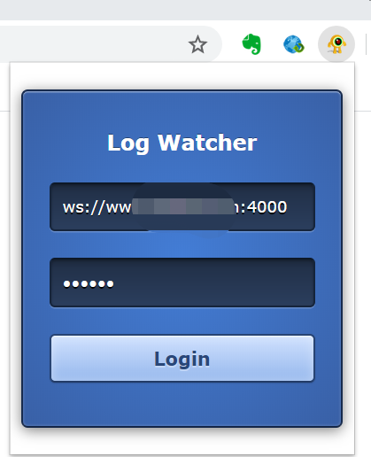
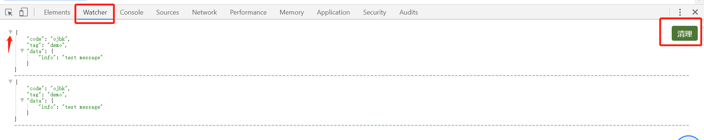

## 日志在线预览

### 1. 环境

| php        | >= 7.1   |
| ---------- | -------- |
| swoole扩展 | >= 4.3.4 |

### 2. 使用说明

#### 2.1 修改配置文件

进入`src/config`目录.配置文件分为三部分,`Option.php`为公共部分,`OptioinShip.php`为websocket服务所需要的配置文件, `OptionPaddle.php` 为日志生产的客户端服务的配置文件.部分配置说明如下:

```php
public static $logCode = "key"; //用于判断后端写日志时身份验证的秘钥
public static $clientCode = ["client1_code","client2_code"];// 客户端接收的秘钥
public static $cacheOpt=[];//缓存配置,目前仅支持redis(单机版)/File文件缓存
public static $host = "127.0.0.1"; //监听的host地址
public static $port = 4002;//端口号
public static $option=[];// swoole的基础配置,可根据自己的环境修改
public static $events=[];//注册的回调事件类,该出文件均放在events目录
public static $logExtStatic =[
      "method"=>ClassName::class
]; //扩展第三个系统写入日志的类,静态调用
public static $logExt = [  //用于扩展日志模块,配置静态方法
      "method"=>ClassName::class  //普通对象方式调用(与静态调用配置互斥).优先级,静态调用优先
];
```

#### 2.2 运行

进入 `src`:

```shell
php Ship.php
php Paddle.php
```

运行服务.

#### 2.3 chrome插件:

使用websocket服务可以单独跑,或者可以使用配套的谷歌扩展进行日志信息的预览功能:



后台服务启动以后,打开chrome,点击插件,填写服务信息,点击`Login`,然后打开F12进入调试模式:



控制面板多出一个watcher的选项卡,推送的json字符串日志信息,会自动格式化,并可以折叠,点击清理,可以清理屏幕.


